# Student Performance Analysis Using Apache Spark

**A comprehensive data-driven analysis of student performance leveraging distributed computing for educational insights.**

---

## 🧠 Introduction / Motivation

Educational institutions increasingly rely on data analytics to understand student performance, identify achievement gaps, and inform policy decisions. This project applies large-scale data processing and statistical analysis to a real-world student performance dataset, aiming to uncover patterns and actionable insights that can drive educational improvements. By leveraging Apache Spark, we ensure scalability and efficiency, making the approach suitable for both academic research and industrial applications.

## 📊 Dataset Description

| **Property**       | **Description**                                                                                               |
| ------------------ | ------------------------------------------------------------------------------------------------------------- |
| **Source**         | `StudentsPerformance.csv` *(public, anonymized dataset)*                                                      |
| **Size**           | ~1,000 records                                                                                                |
| **Representation** | Each record = 1 student                                                                                       |
| **Features**       | `gender`, `ethnicity`, `education`, `lunch`, `preparationCourse`, `mathScore`, `readingScore`, `writingScore` |

**Preprocessing:**
- Data is parsed and mapped to a `Member` class for structured access.
- Type conversions and basic cleaning are performed during ingestion.

## ⚙️ Methodology / System Architecture

The analysis pipeline is implemented in Scala using Apache Spark's RDD API for distributed computation. The system is modular, with each analytical task encapsulated in a dedicated object. Key steps include:

```mermaid
graph TD
    A[📥 Data Ingestion] --> B[🧹 Preprocessing & Mapping]
    B --> C[📈 Statistical Analysis]
    C --> D[🎯 Performance Segmentation]
    C --> E[🌍 Demographic Analysis]
    C --> F[📘 Impact Studies]
    D --> G[🏆 Best Performance Filter]
    E --> H[👫 Gender/Ethnicity/Education Analysis]
    F --> I[📖 Preparation Course Impact]
```



### Main Analytical Modules
- **ColumnPercentage:** Computes demographic distributions (gender, ethnicity, etc.).
- **BestPerformanceStudentsFilter:** Identifies students excelling (>95) in all subjects.
- **AverageMark:** Calculates mean, standard deviation, min, and max for each subject.
- **EthnicityPerformance / EducationPerformance:** Analyzes average scores by demographic group.
- **ExamPreparationCourseImpact:** Assesses the effect of exam preparation courses.
- **HighlyEducatedParents:** Finds groups with the highest parental education.
- **GenderComparison / GenderLunchComparison:** Compares performance and lunch type by gender.

#### Example: Calculating Average Marks
```scala
val mathMean = rdd.map(_.mathScore).mean()
val readingMean = rdd.map(_.readingScore).mean()
val writingMean = rdd.map(_.writingScore).mean()
```

## 📈 Results & Analysis

| Metric                | Math   | Reading | Writing |
|-----------------------|--------|---------|---------|
| Average               | 66.1   | 69.2    | 68.0    |
| Std. Deviation        | 15.2   | 14.6    | 15.0    |
| Min                   | 0      | 17      | 10      |
| Max                   | 100    | 100     | 100     |

- **Best Performers:** X students scored >95 in all subjects.
- **Gender Gap:** Females outperform males in reading and writing; males slightly ahead in math.
- **Preparation Course Impact:** Students who completed the course scored on average 5-10 points higher.
- **Ethnicity & Education:** Higher parental education correlates with better student performance.

## 🧩 Challenges & Solutions

- **Data Quality:** Addressed missing or malformed entries during preprocessing.
- **Scalability:** Used Spark RDDs to handle large datasets efficiently.
- **Feature Engineering:** Encapsulated data in a `Member` class for type safety and clarity.

## 💡 Key Insights

- **Preparation courses have a measurable positive impact** on student scores, especially in writing.
- **Socio-demographic factors** (ethnicity, parental education) significantly influence performance.
- **Gender differences** persist, with actionable implications for targeted interventions.
